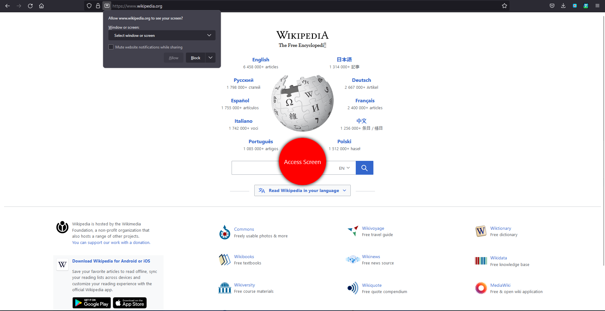
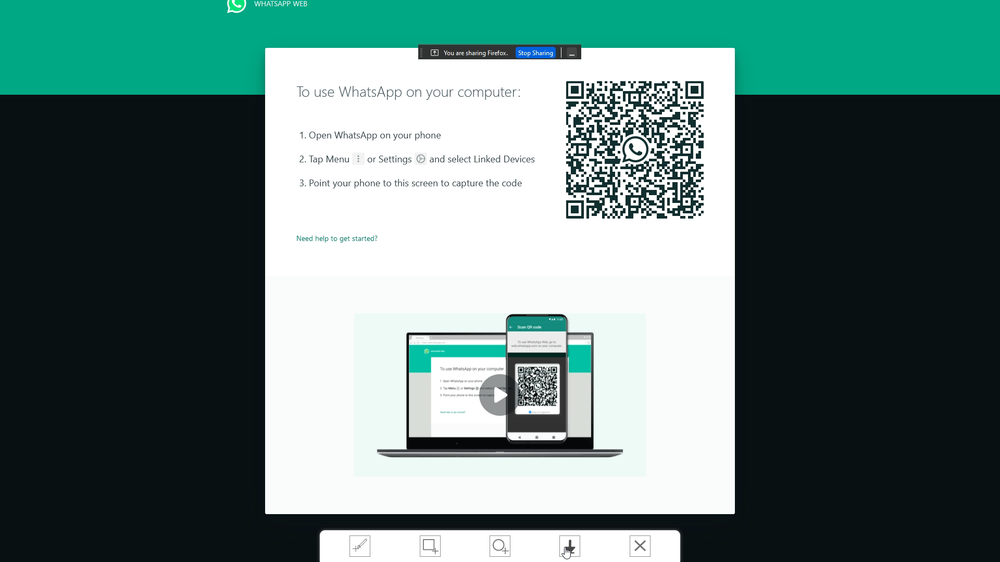

#Take-Screenshots
### A mozilla firefox extension to take screenshots of different shape with different tools.

---

### Screenshots of the extension.

This add-on helps the users to take screen shots.
It has three tools of taking screen shots , which are :
1. Polygon Clipping : Using this one can take a screen image of irregular shape.
2. Rectangular Clipping : Using this one can take a rectangular shaped screen shot.
3. Circle Clipping : Using this one can take a Circular shaped screen shot.

These tools are depicted at the bottom of the screen.
### Note :
This add-on works only when it is in a full screen mode and when has access to the display screen.
so the user needs to provide access to the required resources through red color circular buttons which will be displayed at the center of the screen whenever you press the extension icon.
